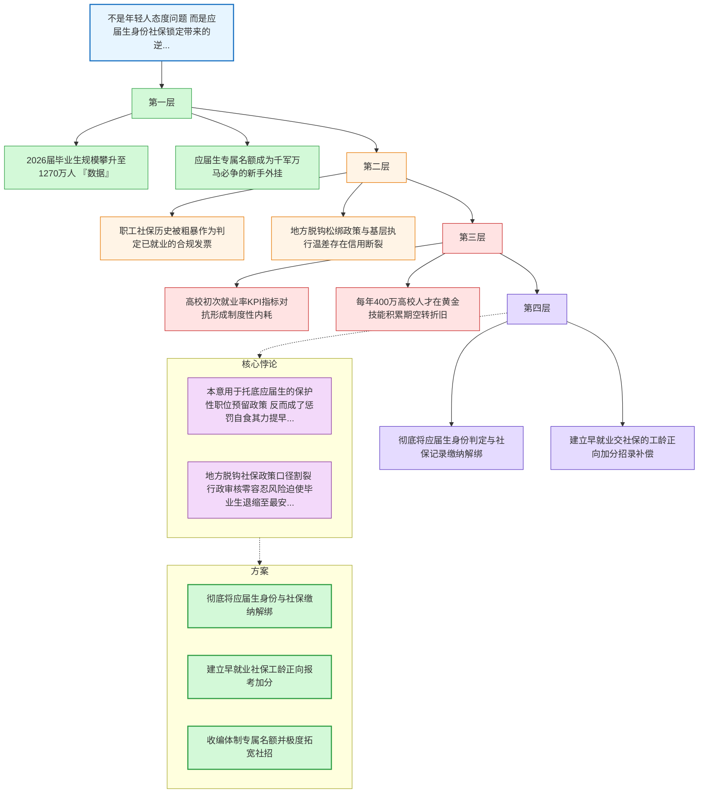

# 大学生就业与应届生身份悬空 - 论证链条可视化

```mermaid
graph TB
    %% 《睡前消息》论证链条可视化
    %% 议题: 大学生就业与应届生身份悬空
    %% 生成时间: 2026-05-19 03:49
    
    %% 样式定义
    classDef core fill:#e7f5ff,stroke:#1971c2,stroke-width:2px
    classDef layer1 fill:#d3f9d8,stroke:#2f9e44
    classDef layer2 fill:#fff4e6,stroke:#e67700
    classDef layer3 fill:#ffe3e3,stroke:#c92a2a
    classDef layer4 fill:#e5dbff,stroke:#5f3dc4
    classDef layer5 fill:#c5f6fa,stroke:#0c8599
    classDef paradox fill:#f3d9fa,stroke:#862e9c
    classDef solution fill:#d3f9d8,stroke:#2f9e44,stroke-width:2px
    
    %% 核心定义
    Core[不是年轻人态度问题 而是应届生身份社保锁定带来的逆...]:::core
    L1[第一层]:::layer1
    Core --> L1
    P11[2026届毕业生规模攀升至1270万人 『数据』]:::layer1
    L1 --> P11
    P12[应届生专属名额成为千军万马必争的新手外挂]:::layer1
    L1 --> P12
    L2[第二层]:::layer2
    L1 --> L2
    P21[职工社保历史被粗暴作为判定已就业的合规发票]:::layer2
    L2 --> P21
    P22[地方脱钩松绑政策与基层执行温差存在信用断裂]:::layer2
    L2 --> P22
    L3[第三层]:::layer3
    L2 --> L3
    P31[高校初次就业率KPI指标对抗形成制度性内耗]:::layer3
    L3 --> P31
    P32[每年400万高校人才在黄金技能积累期空转折旧]:::layer3
    L3 --> P32
    L4[第四层]:::layer4
    L3 --> L4
    P41[彻底将应届生身份判定与社保记录缴纳解绑]:::layer4
    L4 --> P41
    P42[建立早就业交社保的工龄正向加分招录补偿]:::layer4
    L4 --> P42

    %% 核心悖论
    subgraph paradox[核心悖论]
        Paradox1[本意用于托底应届生的保护性职位预留政策 反而成了惩罚自食其力提早...]:::paradox
        Paradox2[地方脱钩社保政策口径割裂 行政审核零容忍风险迫使毕业生退缩至最安...]:::paradox
    end
    L4 -.-> paradox

    %% 方案钩子
    subgraph solutions[方案]
        Sol1[彻底将应届生身份与社保缴纳解绑]:::solution
        Sol2[建立早就业社保工龄正向报考加分]:::solution
        Sol3[收编体制专属名额并极度拓宽社招]:::solution
    end
    paradox -.-> solutions
```