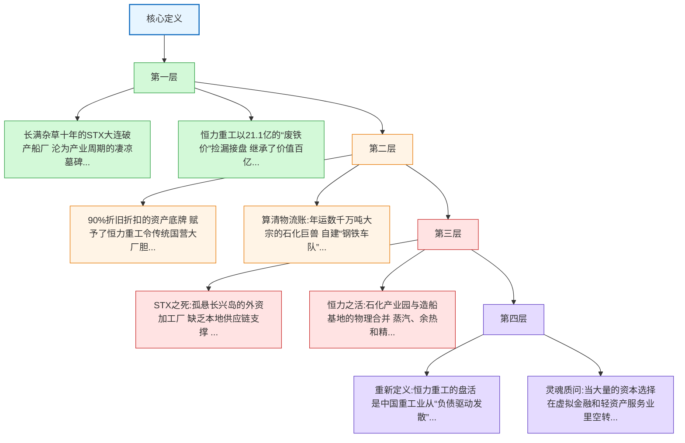

# 恒力重工135亿船舶产能扩建 - 论证链条可视化

```mermaid
graph TB
    %% 《睡前消息》论证链条可视化
    %% 议题: 恒力重工135亿船舶产能扩建
    %% 生成时间: 2026-05-19 03:23
    
    %% 样式定义
    classDef core fill:#e7f5ff,stroke:#1971c2,stroke-width:2px
    classDef layer1 fill:#d3f9d8,stroke:#2f9e44
    classDef layer2 fill:#fff4e6,stroke:#e67700
    classDef layer3 fill:#ffe3e3,stroke:#c92a2a
    classDef layer4 fill:#e5dbff,stroke:#5f3dc4
    classDef layer5 fill:#c5f6fa,stroke:#0c8599
    classDef paradox fill:#f3d9fa,stroke:#862e9c
    classDef solution fill:#d3f9d8,stroke:#2f9e44,stroke-width:2px
    
    %% 核心定义
    Core[核心定义]:::core
    L1[第一层]:::layer1
    Core --> L1
    P11[长满杂草十年的STX大连破产船厂 沦为产业周期的凄凉墓碑...]:::layer1
    L1 --> P11
    P12[恒力重工以21.1亿的“废铁价”捡漏接盘 继承了价值百亿...]:::layer1
    L1 --> P12
    L2[第二层]:::layer2
    L1 --> L2
    P21[90%折旧折扣的资产底牌 赋予了恒力重工令传统国营大厂胆...]:::layer2
    L2 --> P21
    P22[算清物流账:年运数千万吨大宗的石化巨兽 自建“钢铁车队”...]:::layer2
    L2 --> P22
    L3[第三层]:::layer3
    L2 --> L3
    P31[STX之死:孤悬长兴岛的外资加工厂 缺乏本地供应链支撑 ...]:::layer3
    L3 --> P31
    P32[恒力之活:石化产业园与造船基地的物理合并 蒸汽、余热和精...]:::layer3
    L3 --> P32
    L4[第四层]:::layer4
    L3 --> L4
    P41[重新定义:恒力重工的盘活 是中国重工业从“负债驱动发散”...]:::layer4
    L4 --> P41
    P42[灵魂质问:当大量的资本选择在虚拟金融和轻资产服务业里空转...]:::layer4
    L4 --> P42
```