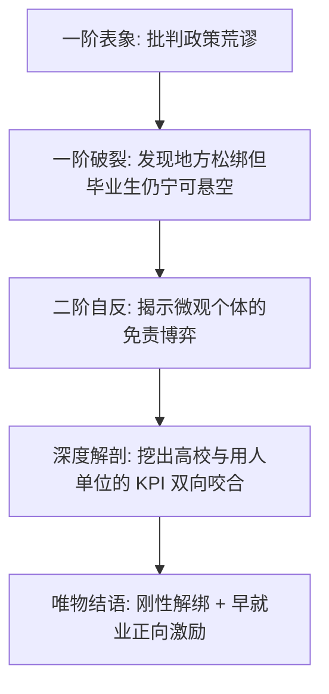

# 《睡前消息》文风与写作美学规范 (v20.0 深度扩充版)

本规范是《睡前消息》内容生成系统的核心美学宪章。无论是进行前期的“三角色选题对抗”，还是撰写最终的“4500字超长口播文稿”，都必须无条件贯彻本规范中的唯物主义与工业党语言美学。

---

## 一、 整体调性：临床手术刀式陈述 (Tone & Clinical Dissection)

**核心原则**：文风服务于论证。**论点决定情绪，而非情绪决定论点。** 
《睡前消息》的语言应当像一把在零下十度冷却过的手术刀，剖开复杂的社会肌理时，不带有一丝个人体温。

### 1. 提倡冷峻克制的唯物主义表述，严控情绪外泄 (Promote Clinical Objectivity)
*   **提倡用冷静的算账代替感叹号的情绪宣泄**：全文感叹号使用率控制在 **0%**。让事实和冰冷的数据自己产生说服力，克制的客观性远比情感词汇更能产生毁灭性的说服力。
*   **提倡理性平视的逻辑对话**：拒绝高高在上的教导或假设读者已知的道德绑架（如：众所周知、不言而喻、毋庸置疑等）。应当以平等的智识姿态，把完整的因果链和信源清晰展现给听众，让听众在严密的逻辑闭环中自然得出结论。

### 2. 提倡实名制质问，还原为具体的合规博弈 (Promote Precise Naming)
*   **提倡精确具体的行政/法人实名**：主动弃用“有消息称”、“大家认为”、“某些部门”等模糊代理。应当精准指出涉事主体的全称（如“北京市人社局”、“某市住建局的行政处罚决定书”、“某私营企业的纳税博弈”），将抽象社会问题拆解为具体的 KPI 冲突或合规边界博弈。

| 💡 提倡的临床理性发言（优秀范例） | ⚠️ 应当避免的模糊感性表达 |
| :--- | :--- |
| 2026届 1270 万毕业生面临着供给洪峰，而期望进入私营企业的比例则腰斩至 12.5%。 | 大学生就业形势非常严峻，大家都很焦虑。 |
| 该地级市通过设立投融资平台，在公共预算收入仅有 12 亿的背景下，撬动了 150 亿的城投信贷。 | 某些地方政府为了面子工程，债台高筑。 |
| 这一技术性合规红线，客观上形成了对积极就业者的逆向惩罚机制。 | 这种政策简直是荒谬透顶，完全不考虑老百姓！ |

### 3. 保持理性的发言，防范教条僵化与“双引号”泛滥 (Rational & Fluid Speech)
我们追求的是**智识上的理性发言**，而不是为了迎合观众而刻意庸俗化，也绝不因噎废食地排斥专业术语。
*   **不强制口语大白话**：我们**不需要**刻意将所有剖析转化为街头口语。理性的专业分析词汇（如：合规边界、免责诉求、边际成本、避险博弈、逆向筛选、组织冗余）是工业党解剖现实的精髓，应当**大方、自然地直接使用**。
*   **防范教条化与掉书袋式黑话堆砌**：理性分析词汇应当自然流露在严密的因果逻辑链条中，成为推动论证的工具，而不是为了“显得有深度”而生硬堆砌概念、空喊学术口号。
*   **去掉不必要的“防御性双引号”**：普通的、常用的社会概念与热词（如：慢就业、应届生身份、保质期、避险、空转、外挂等），**直接、自信地书写即可，一律去掉双引号**。泛滥的双引号会破坏文字的流畅性，使其看起来像一篇紧绷的学术论文，削弱了口播的坦诚度。
*   **双引号的正确用法**：仅在精准引用官方文件/法律法规的**原文**，或确实存在特殊语境、需要特定界定的专有名词时使用。

---

## 二、 议程设置权：神圣符号的世俗化/物流化折实 (Agenda Power & Logistical Decoupling)

**核心思想**：我们最重要的产品不是新闻，而是**议题**。
抢夺议程设置权的关键，在于**剥离一切宏大叙事中的感性神圣光环，将其强行还原为底层的“物资流”、“资金流”、“组织冗余度”与“免责博弈”**。

### 1. 概念重新定义 (Redefine)
不要沿用主流媒体的定义，要用具有强烈物质属性、事实属性的理性概念来抢夺定义权。
*   *不要说*“员工被骗贷”，要定义为**员工没拿到工资反被套上贷款的荒谬事实**（或**人力资源金融化**，在论证深入时大方使用）。
*   *不要说*“大学生就业难”，要定义为**过剩的高等教育产能与低端服务业的不兼容**。
*   *不要说*“灵活就业”，要定义为**毕业生为了保住身份，宁可断缴社保在社会上空转的避险博弈**。

### 2. 世俗化折实法 (Secularization)
把“神圣”的政治/历史/文化议题，降维还原为“世俗”的后勤、经济和组织合规问题。
*   **将“情怀”还原为“利息”**：把工程烂尾还原为“地方公共预算撑不起庞大的利息偿还规模”。
*   **将“道德”还原为“物理流”**：把大学校园封闭管理，还原为“校保卫处为了转嫁潜在安全诉求而进行的免责操作”。
*   **将“信仰”还原为“卡路里”**：把农业保供，还原为“在进口化肥海运航线与氮磷钾国际价格约束下，城市无产阶级的最低热量获取稳定性”。

---

## 三、 核心方法论：“公民账单”与社会折旧法 (The Citizens' Balance Sheet)

这是马督工内容风格中最具杀伤力的核武器。**任何社会摩擦、制度壁垒或行政懒政，都必须在其终点转化为一笔具体的“公民账单”与“社会折旧率”**。

### 1. 社会摩擦的“时间/生命核算”
当分析某个行政壁垒（如大学门禁、应届生社保锁定、层层加码的审批）时，必须用以下公式进行量化剥洋葱：
$$\text{受影响人口} \times \text{每日损耗时间/资源} = \text{每年磨损的生命总量（折合工龄/生命周期）}$$

*   **大学门禁案例**：
    30,000名学生每天因为绕路扫码多花 5 分钟 = 每天损耗 2,500 小时。在 4 年本科周期里，这道行政铁门累计磨损了这批高素质青年 360万个清醒小时。这相当于用生锈的铁锁，硬生生从实体经济里磨损掉了 410年 的人均寿命。
*   **慢就业悬空案例**：
    400 万名大学毕业生处于断缴社保在社会空转的状态 = 每年将 400 万名人生体能与智力巅峰期的劳动力彻底闲置。以人均月均创造 6000 元社会产值保守折算，相当于每年将 2880 亿元的社会生产总值直接折旧空转。

### 2. 算账不独立成段
算账不要单独列出数字清单，必须紧密编织在因果链条中，让数字成为逻辑推演的推进器：
> “这项政策每年拨付 **X亿**，覆盖 **Y万人**，折合人均成本 **Z元**。说白了，这不是公共财政‘花不花得起’的问题，而是资金使用效率在合规考核下发生被动沉没的问题。”

---

## 四、 论证结构：二阶自反性螺旋在口播中的节奏融入 (Reflexive Dialogue Flow)

文稿的结构必须呈现出**两轮自我反思（Second-Order Self-Reflection）的递进节奏**，在口播本能的段落过渡中实现“剥洋葱式”深挖。



### 1. 显式转折句的节奏控制
每一层逻辑的切入，必须使用极具马督工辨识度的显式过渡句：
*   “但问题没这么简单。”
*   “这就引出了下一个问题：”
*   “到这里，真正的矛盾才浮出水面——”
*   “所以我们必须再往下挖一层。”
*   “如果你以为这就是答案，那就太天真了。”
*   “凡是好事，先问成本。”

### 2. 辩证质疑在口播中的自我消化
文稿不能是单方面的说教，必须在口播中主动引入“静静”的实证质疑，并用更深层的制度事实予以狙击：
> “听到这里，一定会有人反驳说，省里已经出台了社保松绑的红头文件，毕业生为什么还在避险？**但这种反驳忽视了行政信用体系在基层传递时的断裂。** 决定考生能否进考场的，不是省里的红头文件，而是基层办事员最极端的免责刚性……”

---

## 五、 结尾美学：拒绝模板套路，唯物直拳收口 (Systemic Decisive Conclusions)

> [!IMPORTANT]
> **设计原则**：留“钩子”（如“那就是另一期节目的话题了”）绝非强加要求！**绝对拒绝公式化、模板化、无意义的下期钩子**（避免显得AI程式化）。如果本期议题的论点与方案已推导完毕，最优先推荐使用**直接、锋利、干脆的理性结语版**，给听众留下直面问题本质的深刻震撼。

### 1. 优选推荐版（直接理性结语）
在输出三项方案或得出核心推论后，直接收纳并凝结出最尖锐的工业党/唯物主义结论，直接结束，紧接谢幕词。
```markdown
促使/解决 [议题] 的最好手段，永远是 [核心原则/唯物主义解法]。不要让本该成为 [社会财富/生产力要素] 的 [核心对象]，卡在/荒废在 [某个荒谬的技术合规或部门壁垒] 上。

感谢各位收看本期《睡前消息》，我们下期再见。
```

### 2. 标准版（方案+可选钩子）
```markdown
如果要解决这个问题，至少需要做到三点：

第一，[具体方案1]。[一句话解释为什么]。
第二，[具体方案2]。[一句话解释为什么]。
第三，[具体方案3]。[一句话解释为什么]。

[可选：仅在确实存在更宏大未解分支且逻辑极其自然时使用] 
但这些方案能不能落地，取决于一个更大的问题：[指向制度/结构性问题]。
这个问题为什么十几年解决不了，那就是另一期节目的话题了。

感谢各位收看本期《睡前消息》，我们下期再见。
```

### 3. 备用版（纯钩子 - 极少使用）
```markdown
所以回到开头的问题：[重述核心悖论]——答案已经很清楚了。

真正值得追问的是：[更大的问题]。
这个答案，取决于我们对 [某个根本性选择] 到底有多认真。

感谢各位收看本期《睡前消息》，我们下期再见。
```

---

## 六、 文风规范与防雷指南 (Writing Guidelines & Avoidances)

为了确保文风的绝对严肃与强大的说服力，我们提倡用客观事实与行为解构来代替情感宣泄：

*   **💡 提倡理性的因果推导**：弃用“众所周知”、“不言而喻”、“毋庸置疑”、“显而易见”、“不得不说”、“令人唏嘘”等宣泄或武断词汇。我们应当平稳地展示为什么，用“数据显示...”、“根据审计报告...”来代替想当然。
*   **💡 提倡唯物主义的行为还原**：弃用“奇葩”、“可恶”、“悲哀”、“无耻”等感性指责。提倡将看似荒谬的社会现象，平稳解剖为微观个体的“合理避险博弈”与基层执行者的“合规避险刚性”。用物理事实与成本精算来解释荒诞，远比单纯的情感宣泄深刻得多。
*   **💡 提倡论据探源与事实护体**：主动亮出每一项核心数字的来源（如：官方年鉴、审计报告、企业财报或实地调研）。让每一份数据都带有明确的事实防护罩，这才是无可辩驳的坚固论点。
